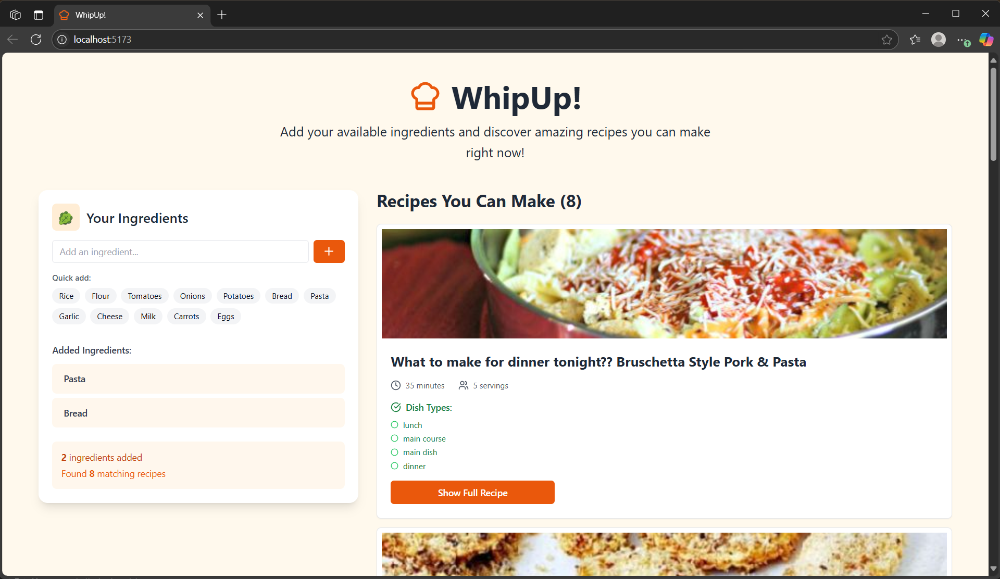

# 🧑‍🍳 WhipUp!

**WhipUp** is a modern, minimal recipe discovery app where you can find dishes based on ingredients you already have. Just enter what's in your kitchen, and get delicious recipe suggestions instantly!

> ✨ Inspired by the sleek UX of [lovable.app](https://preview--kitchen-recipe-creator-app.lovable.app/)

---

### 🚀 Features

- 🔎 Add ingredients manually or with quick-select chips
- 📖 Discover recipes via the [Spoonacular API](https://spoonacular.com/food-api)
- 🖼️ Displays rich recipe info: title, image, cook time, servings, diet types
- 🧼 Clean, modern UI built with **React + Tailwind CSS**
- ⚡ Instant feedback on ingredient matches

---

### 🏗️ Folder Structure

```bash
src/
│
├── components/
│   ├── Header.jsx
│   ├── Body.jsx
│   ├── AddIngredients.jsx
│   └── Recipes.jsx
│
├── App.jsx
├── index.css
└── main.jsx
```

---

### 🧪 Tech Stack
  -  Frontend: React, Tailwind CSS
  -  API: Spoonacular (recipe search by ingredients)
  -  Icons: Lucide React Icons

---

### 🔧 Getting Started

1.  Clone the Repo
```bash
git clone https://github.com/your-username/whipup.git
cd whipup
```

2.  Install Dependencies
```bash 
npm install
```

3.  Set Up Environment Variables
    Create a .env file in the root:

```bash
VITE_SPOONACULAR_API_KEY=your_spoonacular_api_key
```

4.  Run the App
```bash
npm run dev
```
Visit: http://localhost:5173

---

### 📸 UI Preview


---

### 📬 Feedback & Suggestions

Have ideas to improve this project? Found a bug or issue?  
Feel free to [open an issue](https://github.com/Mahek2905/WhipUp/issues) or drop your suggestions [here](mailto:maheksachdev2910@gmail.com).  
I'd love to hear your feedback and make this app better together!
